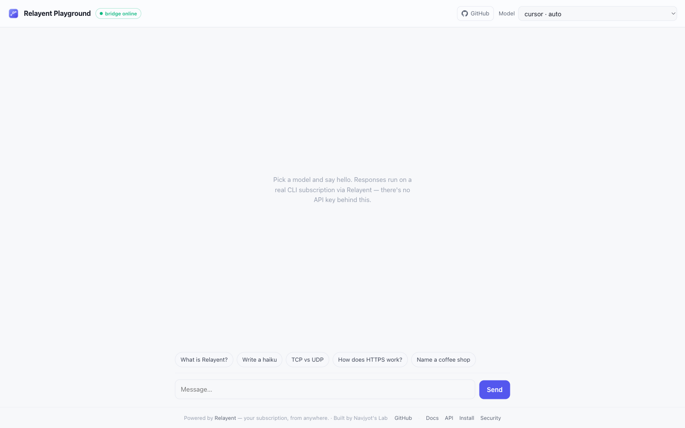
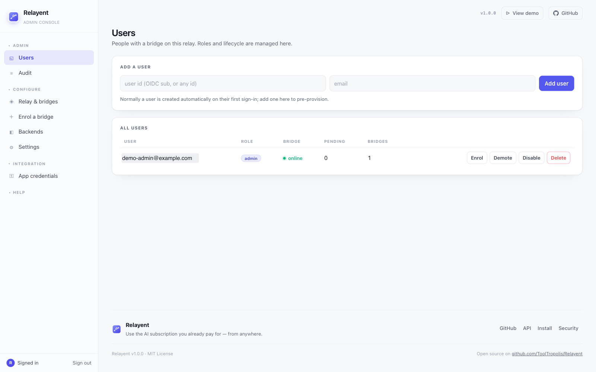
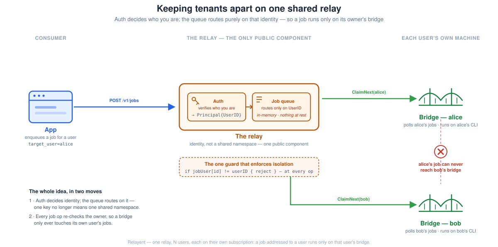

_Relayent — a blend of **relay** and **agent**. It relays your app's calls to an AI coding agent (Claude Code, Codex, Gemini, Cursor) that's already installed and signed in on a machine you control._

> **Try it:** there's a live playground at **[relayent-demo.ignorelist.com](https://relayent-demo.ignorelist.com)** — pick a model, send a message, and the reply comes back from a real CLI subscription with no API key behind it.

I built Relayent to scratch a very specific itch, and I want to be upfront about its scope before anything else: **this is a tool for the development cycle, not for production.** When you ship to real users, provisioned API tokens are the right answer — that's what they're for. What follows is about the awkward middle: the weeks of building and QA *before* you ship, where you're burning metered tokens just to see if the thing works.

## The gap: you pay for the model twice

You (or your engineers) already pay for an AI subscription. Claude, Codex, Gemini, Cursor — flat monthly price, and generous. You can lean on it all day in your editor and the bill doesn't move.

Then a feature lands on your plate: a chat box in the product, an in-app assistant, a summarizer that fires on every uploaded doc. And none of it can touch that subscription. The subscription is scoped to the IDE-and-CLI experience — it was never meant to sit behind arbitrary application traffic. So the app talks to the metered API instead, billed per token.

Here's the part that stings. You're not even in production yet. You're *developing*. Every test run, every "does this prompt actually work," every QA pass over the new feature — all of it draws down metered API tokens, for a feature that isn't earning anything yet. **You end up paying twice for the same models:** once for a subscription only a human can use, and again, at API rates, to build and test the feature before a single customer sees it.

Relayent's whole premise is that during that phase, the gap doesn't need to exist. There's an authenticated CLI session already sitting on your dev machine. Why can't your app-under-development borrow it? Relayent routes the app's AI calls to that already-running subscription. **It doesn't proxy an API key or store a credential — it never touches the CLI's auth at all.** It just uses the session that's already there.

To be clear about where the line is: use this to *develop and QA* against real models without watching a token meter spin. When the feature goes live, wire up proper API tokens. Relayent is a dev-cycle convenience, not a production dependency, and I'd push back on anyone trying to make it one.

## How it works

There are just two moving pieces:

- **The relay** — a small job broker that both sides can reach over the network. Your app POSTs jobs to it and long-polls for results. Where it lives is up to you: a public host, an internal box on your intranet, or even localhost on the same machine as the bridge.
- **The bridge** — runs on your own machine, right next to the signed-in CLI. It dials *out* to the relay, pulls jobs meant for you, runs the AI coding agent headlessly, and posts the result back.

The bridge is where the security story really lives. **It only ever makes outbound connections** — it opens nothing for the relay (or anyone else) to connect back into, so there's no port to scan, no service to attack on your machine. And crucially, **your AI subscription and API keys never leave that machine.** The bridge uses the CLI's own already-signed-in session locally; it doesn't read your credentials, doesn't copy them, and doesn't send them to the relay. The relay only ever sees a job going in and a result coming out — never a token, a password, or a subscription. So even a compromised relay never gets your credentials; the worst it can do is queue jobs, not walk away with the keys to your subscription.

So the flow is small on purpose. Your app POSTs a job to the relay; the bridge — on the machine with the logged-in CLI — dials out, polls for work, runs the CLI headlessly, and returns the answer.

```text
  Your app  ──POST──▶  Relay  ◀──poll out──  Bridge
              job    (network-reachable)      (your machine, dials OUT)
                                                     │
                                                     └─▶ claude / codex / gemini / cursor
```

The shape does two useful things. **Nothing listens on the dev machine** — no inbound port, no tunnel, no NAT to punch through. The bridge is purely a client; it reaches out, never the reverse. And the relay is the only component anything connects *to*, so it's the only attack surface to harden — and if you expose it to the public internet, the only thing that has to be internet-hardened. No credentials pass through Relayent itself; the CLI on the bridge uses its own session, and the relay never sees a password or an API key.

The relay is a small Go job broker behind a versioned `/v1` API — POST a job, long-poll the result. Four backends work today: `claude`, `codex`, `gemini`, and `cursor`. (Cursor runs in `--mode ask`, read-only, so a job can't edit files or run shell commands on the bridge.) Install and sign into whichever CLI you want to lend out, and it shows up — no restart.

## The demo playground

The fastest way to get the idea is to go use it: **[relayent-demo.ignorelist.com](https://relayent-demo.ignorelist.com)**.

> **Note:** on the public demo, only **Cursor** works out of the box — the other backends (Claude, Codex, Gemini) are switched off to keep strangers from spending paid quota. Pick Cursor to see a live reply.



It's a plain chat page — pick a model, type, get a reply. Nothing fancy, and that's the point: every reply on that page is running on a real CLI subscription behind a bridge, not on any API key. The model dropdown isn't hardcoded either; it's populated live from the relay's capabilities, so it only ever lists what a connected bridge can actually run.

Under the hood the demo is a thin proxy. The browser only ever talks to the demo server's own `/api/*` endpoints, which forward to the relay with a server-side credential — the app credential never reaches the page. And which models the demo is *allowed* to offer is a policy decision made in the admin console (more on that next). For a public demo like this one, you keep the paid backends switched off and expose something you don't mind strangers exercising — otherwise a public URL is just a way to let the internet spend your quota.

## The admin panel

Once more than one person is using a relay, you need somewhere to run it from. That's the admin console.



You sign in with your identity provider — Google, or any OIDC issuer — and land here. It's organized into a few groups:

- **Users** — everyone with a bridge on the relay: their role, whether their bridge is online, how many jobs are pending, how many bridges they've bound. Promote, demote, disable, or remove someone from the same row.
- **Enrol a bridge** — mint a one-time token so a specific user can pair their machine. That's how a bridge gets bound to exactly one person.
- **Backends** — the on/off switches for `claude` / `codex` / `cursor` / `gemini`. This is the control that keeps a public demo from touching your paid subscriptions: flip the expensive ones off and they simply aren't reachable.
- **App credentials** — issue and revoke the credentials your apps (and the demo) use to enqueue work.
- **Audit** — a per-user activity trail: job counts, backends, timing. Notably, *not* the prompts or results — the console shows what happened, never what was said.

One deliberate choice worth calling out: **the admin is an operator, not an observer.** You can see that Alice ran forty jobs on Cursor yesterday and that her bridge is online right now. You cannot see what she asked. That boundary is structural, not a UI toggle — there's simply nowhere in the audit record for prompt content to live.

The console is the admin's view. Everyone else gets their own: sign in as a regular user and you land on a status page scoped to *you* — is my bridge online, which backends can it run, how many jobs are queued — and nothing about anyone else. Same sign-in door (`/login`), routed by role: admins to the console, users to their own page. It's the same operator-not-observer line drawn one level down — you can see your own machine, not the relay's other tenants.

## The interesting part: keeping tenants apart

Everything above is easy with one user. It gets interesting the moment several people share a relay, each bringing their own subscription — which is exactly the setup where this is useful for a team. Now the relay is holding several authenticated sessions at once, and **it has to guarantee that Alice's prompt can never be picked up by Bob's bridge.** If it could, Alice would be quietly spending Bob's quota, on Bob's machine, and Bob would never know.

The tempting shortcut is a single shared pairing key — but that quietly makes one secret do three different jobs at once: authenticating the caller, identifying the tenant, and naming the routing namespace. Possession becomes authorization, and anyone holding the key *is* you: no way to tell tenants apart, no way to revoke just one. That's exactly the property you can't have when several people's subscriptions sit behind one relay.

So Relayent pulls those three jobs apart. Every request carries a `Principal`:

```go
type Principal struct {
    UserID string
    Kind   string
    Scopes []string
    KeyFP  string
}
```

Auth decides *who you are*; the queue routes purely on `UserID`. And the queue is keyed by that id all the way down, so one person's jobs and another's are never even in the same list:

```go
if q.jobUser[id] != userID {
    return false // unknown job, or another tenant's — same answer either way
}
```

That check sits at every method that touches a job by id. Knowing a job id isn't enough to do anything with it — you also have to *be* the user it belongs to, resolved from your Principal, not from something you put in a request body. And it fails identically whether the job doesn't exist or just isn't yours, so probing can't even confirm a job exists in a namespace you can't see.



## On security, briefly

I'll keep this short, because it's a blog post and not a threat model. Relayent was built security-first: the bridge only ever dials out (nothing to attack on the user's machine), no credentials pass through the relay, the pairing key is a bearer secret checked in constant time and never logged, humans sign in via OIDC so there's no password anywhere at rest, and machine credentials are stored hashed. Per-user isolation is enforced and tested, anti-spoofing guard included.

![Relayent data-protection diagram in two rows. TODAY: app, relay, and bridge icons; both hops are TLS-encrypted in transit, and the amber relay sees prompts and results in the clear. PLANNED end-to-end (rolling out): the app seals the prompt to the bridge's key, the green relay routes only sealed ciphertext it cannot read (just routing metadata — who, which job, backend), and the bridge is the only place that can decrypt it. A strip lists the controls the relay protects today — dial-out-only bridge, no credentials through the relay, constant-time pairing key, OIDC sign-in, hashed machine credentials, tested per-user isolation](../architecture/security-arch.svg)

The one honest caveat I'd want any reader to take away: **isolation here is authorization, not encryption.** Tenants can't reach each other's jobs, but the relay operator's process still holds prompts and results in memory in the clear while a job runs. **Don't push secrets through a relay you don't trust.** If you want the full picture — including what it deliberately *doesn't* protect against — [SECURITY.md](https://github.com/ToolTropolis/Relayent/blob/main/SECURITY.md) lays it out without spin.

## Where this lands

Relayent solves one problem well: during development and QA, let your app lean on the AI subscription you're already paying for, instead of quietly metering API tokens on a feature that isn't live yet. Point your team at it, give everyone their own bridge, and the dev-cycle token bill largely goes away.

**And it all runs in your own environment.** You can stand the whole thing up locally — relay and bridge on machines you control — so nothing leaves your network and no data goes to a third party. **You never hand Relayent a key or a subscription;** you just install and sign into the AI coding agents you already use (Claude Code, Codex, Gemini, Cursor), and the bridge picks them up automatically. Your credentials stay where they are, your prompts and results stay in your environment, and **full data privacy is the default, not a configuration step.**

Just don't mistake it for a production answer. In prod, provisioned API tokens are the right tool — properly scoped, properly billed, properly supported. Relayent is the thing that saves you money on the way there.

## Try it in your own environment

The demo is the two-minute version. If you want to actually run it — stand up a relay, pair a bridge on your own machine, and point a dev build at it — everything you need is in the repo:

- **[INSTALL.md](https://github.com/ToolTropolis/Relayent/blob/main/INSTALL.md)** — start to finish: build the bridge, run a relay (localhost, private, or public with automatic TLS), verify it, and troubleshoot. Exact commands, expected output.
- **[README.md](https://github.com/ToolTropolis/Relayent/blob/main/README.md)** — the overview, quick start, and the multi-tenant setup if you're running it for a team.
- **[API.md](https://github.com/ToolTropolis/Relayent/blob/main/API.md)** — the `/v1` contract for wiring your app in: every call, what the numbers mean, and a runnable client.
- **[SECURITY.md](https://github.com/ToolTropolis/Relayent/blob/main/SECURITY.md)** — the full threat model and, importantly, what it deliberately *doesn't* protect against. Read this before you put a relay on the internet.

A local relay + one bridge takes a few minutes and needs nothing but the CLIs you already have signed in. Kick the tires at **[relayent-demo.ignorelist.com](https://relayent-demo.ignorelist.com)**, and the code's on [GitHub](https://github.com/ToolTropolis/Relayent).
